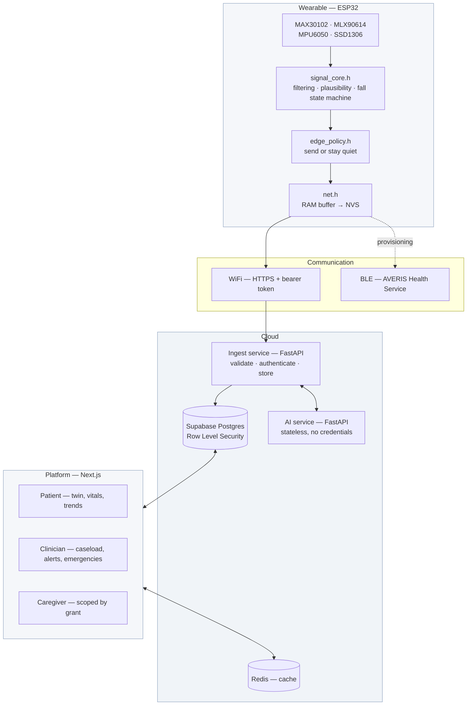
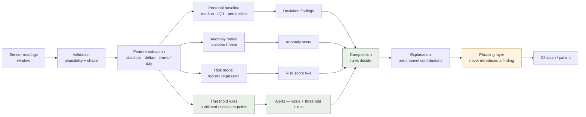
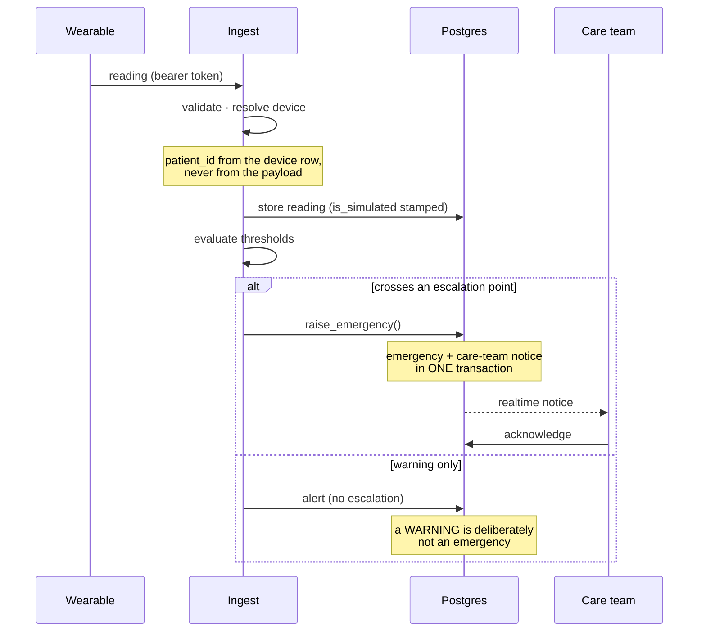
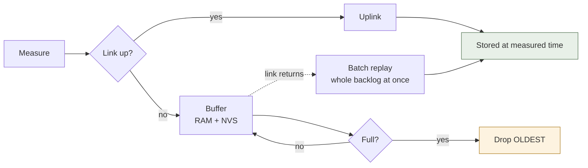

# AVERIS AI — project documentation

---

## Abstract

AVERIS is a remote health-monitoring platform: an ESP32-based wearable that
measures heart rate, blood oxygen, skin temperature and motion; an ingest
service that authenticates devices and stores their readings; an analysis layer
that learns each patient's own baseline and detects deterioration; and a
clinician-facing platform where alerts arrive with the measurement and the
threshold that produced them.

Its distinguishing property is not any single component. It is that the path
from a sensor to a sentence on a clinician's screen preserves provenance and
explicability end to end, and refuses to fabricate at each point where doing so
would be easier — an absent model returns "no model" rather than "no fall", an
undermeasured calibration returns "insufficient" rather than a figure, and a
metric that cannot be computed returns null with a reason rather than zero.

**AVERIS has not been clinically validated and makes no diagnostic claim.**
Every model card, the security report and the hardware validation protocol state
what has and has not been established.

---

## 1. Problem statement

Continuous physiological monitoring outside hospital is unavailable to most of
the people who would benefit from it. Three structural facts shape the design:

1. **Deterioration is gradual; monitoring is episodic.** Saturation falling from
   97% to 89% over six hours is invisible to a once-a-day measurement.
2. **The patients who need it most are the least connected.** Rural deployment
   means intermittent power and intermittent network.
3. **An alert nobody can check is an alert nobody trusts.** "Risk 0.86" with no
   reason cannot be acted on, and at 3am it is worse than silence.

`SIH_ALIGNMENT.md` carries the full problem framing, including which problem
statements AVERIS does *not* address.

---

## 2. Solution

| Capability | Approach |
| --- | --- |
| Continuous measurement | ESP32 wearable, four I²C sensors, 0.5 Hz sampling |
| Works without a network | RAM buffer mirrored to NVS, batch replay preserving measurement timestamps |
| Battery conservation | Edge suppression bounded by four rules that can only delay a boring reading |
| Early warning | Per-patient baselines plus trend fitting over daily medians |
| Explainability | Rules decide, models score, generative text only phrases |
| Clinician workflow | Caseload triage, care teams with per-permission grants, emergency acknowledgement |
| Emergency response | Emergency and care-team notice written in one transaction |
| Rural access | English/Hindi via template composition, offline-first device |
| Data protection | Row Level Security as the sole authorization mechanism |

---

## 3. Architecture

### 3.1 System

**The boundary that matters** is not drawn as a box: the Next.js application
queries Postgres **as the signed-in user**, over RLS. It holds no service-role
key in any configuration, so a bug in a page cannot read a row the policy would
refuse. Only the ingest service and the background worker hold that key; the AI
service holds no database credential at all.

### 3.2 The AI pipeline

The green path is deterministic and is what decides. The amber box only rewords
what the green path produced; if the language model is unavailable, the finding
still exists in plainer words.

### 3.3 Emergency flow

### 3.4 Offline behaviour

Oldest-first, because after an hour offline the newest readings describe the
patient now. Replayed readings keep their **measurement** timestamp — an outage
that rewrote six hours into a burst at reconnection would look like a clinical
event.

---

## 4. Hardware

| Component | Part | Measures |
| --- | --- | --- |
| MCU | ESP32 DevKit v1 | — |
| Pulse oximeter | MAX30102 | heart rate, SpO₂ |
| Thermometer | MLX90614 | skin temperature (non-contact) |
| IMU | MPU6050 | movement, falls |
| Display | SSD1306 128×64 OLED | local status |
| Alerting | piezo buzzer | local alarm |
| Power | 3.7 V LiPo + TP4056 | ~500 mAh |

Approximate prototype cost: **₹2,000–2,500**.

Pin map and wiring: `docs/hardware.md`. Build order, power path and
troubleshooting: `HARDWARE_SETUP_GUIDE.md`. Firmware decision logic is free of
Arduino symbols and runs on the host — 91 checks in CI.

---

## 5. Software

| Layer | Technology | Notes |
| --- | --- | --- |
| Firmware | Arduino C++ | Header-only logic core, host-testable |
| Ingest | FastAPI (Python 3.13) | Holds service-role key; owner from device row |
| AI service | FastAPI | Stateless, no credentials, local fallback in ingest |
| Database | Supabase Postgres 17 | RLS, Realtime, Storage, pgvector |
| Web | Next.js 16, TypeScript, Tailwind v4 | Server Components; queries as the signed-in user |
| Cache | Redis | Cache and rate-limit counters; no persistence |
| CI | GitHub Actions | Four pipelines, including RLS against real migrations |

---

## 6. AI models

| Model | Type | Trained on | Stated limitation |
| --- | --- | --- | --- |
| Anomaly detection | Isolation Forest | Synthetic vitals distributions | Detects unusual, not unwell |
| Risk prediction | Logistic regression | Public cohort | Not this deployment's population; not calibrated for it |
| Fall detection | Small classifier on IMU windows | **Synthetic motion data** | No real falls in training; biggest gap in the AI story |
| Deterioration trend | Least-squares fit over daily medians | The patient's own history | Needs ~2 weeks of data; population thresholds until then |
| Personal baseline | Median / IQR / percentiles | The patient's own history | Only ever *adds* findings, never suppresses a threshold |

Every model ships a model card carrying its cohort and its caveats, and those
caveats are shown on screen beside the number rather than in a footnote.

**Deliberately absent:** an accuracy column anywhere in the schema. Measuring
whether predictions were *right* needs outcome data AVERIS does not have, and a
nullable column would eventually be filled in with an invented figure.

---

## 7. Results

What has been verified, and by what:

| Area | Method | Result |
| --- | --- | --- |
| Application logic | `npm test` | **650 tests** |
| Row Level Security | Assertions against unmodified production migrations | **267 assertions** |
| Firmware decision logic | Compiled and run on the host | **91 checks** |
| Ingest, engine, AI service | `pytest` | **153 tests** |
| Wire contract | Shared vectors, TypeScript + Python | Passing |
| Backup integrity | `scripts/restore-drill.sh --with-rls` | 227 policies and grants diffed |
| Transport (device → cloud) | `transport_validation.py` | Harness verified against four known targets |
| Sensor accuracy | `docs/hardware_validation.md` | **Not performed** — needs hardware |
| Clinical accuracy | — | **Not established, and not claimed** |

Eight authorization defects were found by *executing* the migrations rather than
reading them — including a caregiver who could not read their patient's name, and
three assertions that were passing while testing nothing. `SECURITY_REPORT.md` §3
lists them.

---

## 8. Future scope

Ordered by what would most change the product's standing:

1. **Clinical validation.** A controlled desaturation study for SpO₂, and real
   falls for the fall model. Everything else is secondary to this.
2. **Real fall training data.** The current model's synthetic training set is the
   largest single weakness in the AI story.
3. **A manufacturable device.** PCB, enclosure, certification path. The current
   build is a breadboard with a protocol.
4. **EMR integration.** HL7/FHIR export so AVERIS is part of a record rather
   than beside it.
5. **Deployment-scale evidence.** A pilot with defined outcomes is what converts
   `/impact`'s prototype metrics into an impact claim.
6. **Partitioning cutover.** `sensor_readings` needs monthly range partitioning
   before a thousand-band deployment; the procedure is written in
   `docs/cloud_architecture.md` §4 and deliberately not run automatically.
7. **More languages.** The template-composition approach extends to any language
   with a reviewer; machine translation of clinical instructions does not.

---

## 9. Document map

| Document | Answers |
| --- | --- |
| `SIH_ALIGNMENT.md` | Problem fit, and which statements this does not address |
| `INNOVATION_REPORT.md` | What is different, and what is not novel |
| `SECURITY_REPORT.md` | The authorization model and nine known weaknesses |
| `FINAL_PROJECT_REVIEW.md` | Honest quality assessment across six dimensions |
| `HARDWARE_SETUP_GUIDE.md` | Building a band, and what to do when it fails |
| `docs/hardware_validation.md` | What is validated and what is not |
| `docs/cloud_architecture.md` | Topology, scaling, partitioning cutover |
| `docs/disaster_recovery.md` | Backups, the restore drill, uncovered gaps |
| `docs/ai_pipeline.md` | Where models are used and where they are not |
| `PRESENTATION.md` | Slide structure and speaker notes |
